# System Architecture - CV Matching Tool

**Project**: Randstad Digital Belgium - CV Matching Tool  
**Version**: 1.0  
**Date**: 08 September 2025  
**Related Documents**: [Technical Specification](./TECH-SPEC.md), [Data Model](./DATA-MODEL.md), [Storage Design](./STORAGE.md)

---

## Table of Contents

1. [Architecture Overview](#1-architecture-overview)
2. [System Components](#2-system-components)
3. [Data Flow Architecture](#3-data-flow-architecture)
4. [Service Architecture](#4-service-architecture)
5. [Integration Architecture](#5-integration-architecture)
6. [Deployment Architecture](#6-deployment-architecture)
7. [Security Architecture](#7-security-architecture)

---

## 1. Architecture Overview

### 1.1 Architectural Style
The CV Matching Tool follows a **Modular Monolith** architecture pattern, providing:
- Clear separation of concerns between modules
- Simplified deployment and development
- Easier testing and debugging
- Path to microservices if needed

### 1.2 High-Level Architecture


### 1.3 Architecture Principles

1. **Single Responsibility**: Each service has one clear purpose
2. **Dependency Inversion**: Services depend on abstractions, not implementations
3. **Fail Fast**: Validate inputs early and provide clear error messages
4. **Idempotency**: Operations can be safely repeated
5. **Observability**: All operations are logged and traceable

---

## 2. System Components

### 2.1 Frontend Components


### 2.2 Backend Services Architecture


---

## 3. Data Flow Architecture

### 3.1 CV Processing Flow


### 3.2 Matching Flow


### 3.3 Rewriting Flow


---

## 4. Service Architecture

### 4.1 Service Dependencies


### 4.2 Service Interfaces

#### 4.2.1 Parser Service Interface
```typescript
interface IParserService {
  parseFile(file: Buffer, filename: string): Promise<RawExtraction>;
  detectFileType(buffer: Buffer): FileType;
  extractText(file: Buffer, type: FileType): Promise<string>;
  parseStructure(text: string): Promise<DocumentStructure>;
}
```

#### 4.2.2 Normaliser Service Interface
```typescript
interface INormaliserService {
  normaliseCandidate(rawData: RawExtraction): Promise<Candidate>;
  mapSkills(skills: string[]): Promise<SkillItem[]>;
  applyImpliedSkills(skills: SkillItem[]): Promise<SkillItem[]>;
  extractExperience(text: string): Promise<ExperienceItem[]>;
}
```

#### 4.2.3 Matcher Service Interface
```typescript
interface IMatcherService {
  matchCandidates(profileId: string): Promise<MatchResult[]>;
  calculateScore(candidate: Candidate, profile: SearchProfile): Promise<ScoreBreakdown>;
  rankResults(results: MatchResult[]): Promise<MatchResult[]>;
  exportResults(results: MatchResult[], format: ExportFormat): Promise<Buffer>;
}
```

### 4.3 Service Communication Patterns


---

## 5. Integration Architecture

### 5.1 AI Integration Layer


### 5.2 AI Provider Strategy

```typescript
interface IAIProvider {
  name: string;
  translate(text: string, targetLang: Language): Promise<TranslationResult>;
  rewrite(content: string, instructions: string): Promise<RewriteResult>;
  detectLanguage(text: string): Promise<LanguageDetection>;
  isAvailable(): Promise<boolean>;
}

class AIProviderFactory {
  static create(providerName: string): IAIProvider {
    switch (providerName) {
      case 'claude': return new ClaudeProvider();
      case 'chatgpt': return new ChatGPTProvider();
      case 'gemini': return new GeminiProvider();
      default: throw new Error(`Unknown provider: ${providerName}`);
    }
  }
}
```

### 5.3 Fallback and Resilience


---

## 6. Deployment Architecture

### 6.1 Development Environment


### 6.2 Production Deployment Options

#### 6.2.1 Vercel Deployment


#### 6.2.2 Containerised Deployment


### 6.3 Scaling Considerations

```mermaid
graph LR
    subgraph "Current Architecture (≤1K CVs)"
        SINGLE[Single Instance]
        LOCAL_FS[Local Filesystem]
        MEMORY[In-Memory Cache]
    end
    
    subgraph "Future Scaling (>1K CVs)"
        MULTI[Multiple Instances]
        SHARED_FS[Shared Filesystem]
        REDIS[Redis Cache]
        DB[Database Layer]
    end
    
    SINGLE -.->|Upgrade Path| MULTI
    LOCAL_FS -.->|Migrate| SHARED_FS
    MEMORY -.->|Replace| REDIS
    LOCAL_FS -.->|Migrate| DB
```



---

## 7. Security Architecture

### 7.1 Security Layers


### 7.2 Data Protection Flow


### 7.3 GDPR Compliance Architecture


---

## Appendices

### A. Technology Decision Matrix

| Component | Options Considered | Selected | Justification |
|-----------|-------------------|----------|---------------|
| Frontend Framework | React, Vue, Angular | Next.js (React) | SSR capabilities, TypeScript support, Vercel integration |
| Backend Framework | Express, Fastify, NestJS | Express | Simplicity, ecosystem, team familiarity |
| Language | JavaScript, TypeScript | TypeScript | Type safety, better tooling, maintainability |
| Storage | PostgreSQL, MongoDB, Filesystem | Filesystem + JSON | Simplicity, no DB overhead, portable |
| AI Integration | Direct APIs, LangChain | Direct APIs | Control, simplicity, cost effectiveness |

### B. Performance Benchmarks

| Operation | Target | Measurement Method |
|-----------|--------|-------------------|
| CV Upload | < 5s | Time from upload to parsed JSON |
| Matching Query | < 800ms | Time from request to ranked results |
| Index Rebuild | < 2s | Time to rebuild all indices |
| PDF Generation | < 10s | Time from request to downloadable PDF |

### C. Monitoring and Observability


---

**Document Version**: 1.0  
**Last Updated**: 08 September 2025  
**Next Review**: 15 September 2025