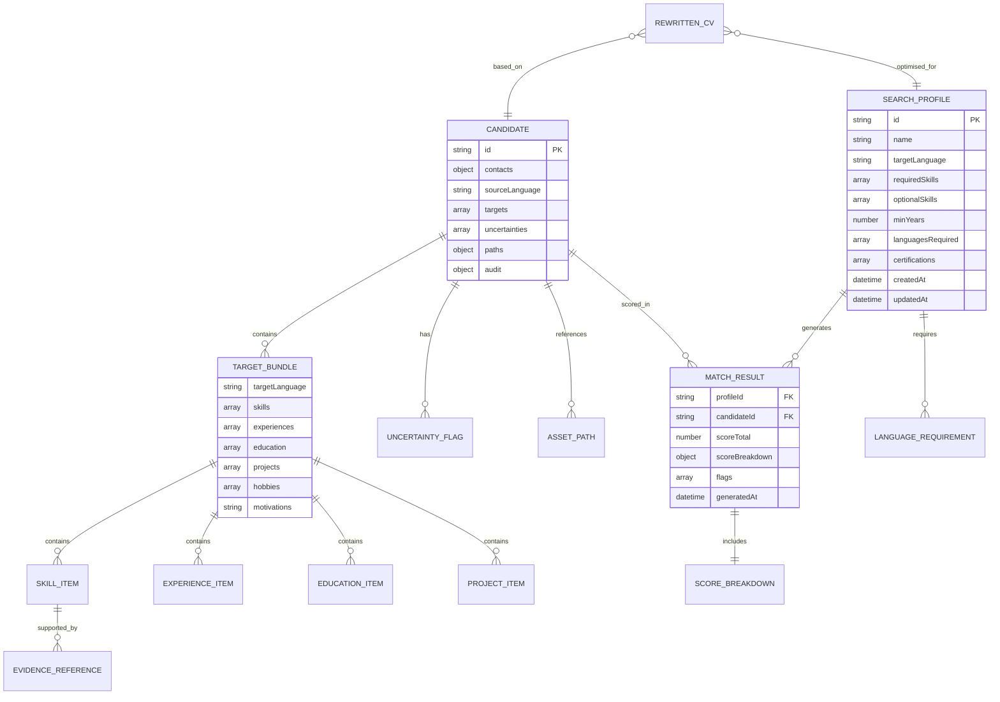
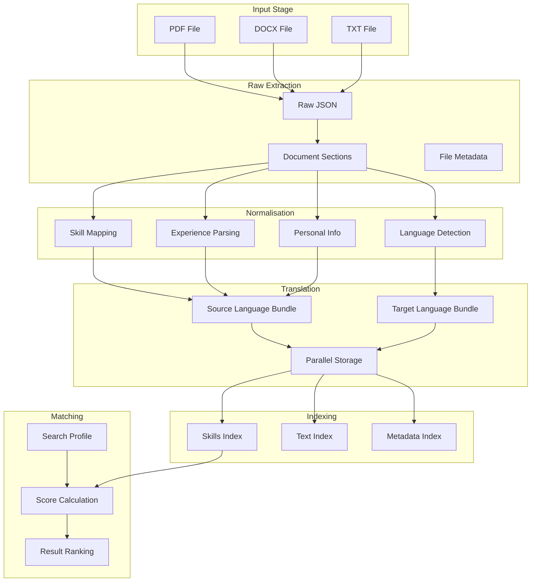
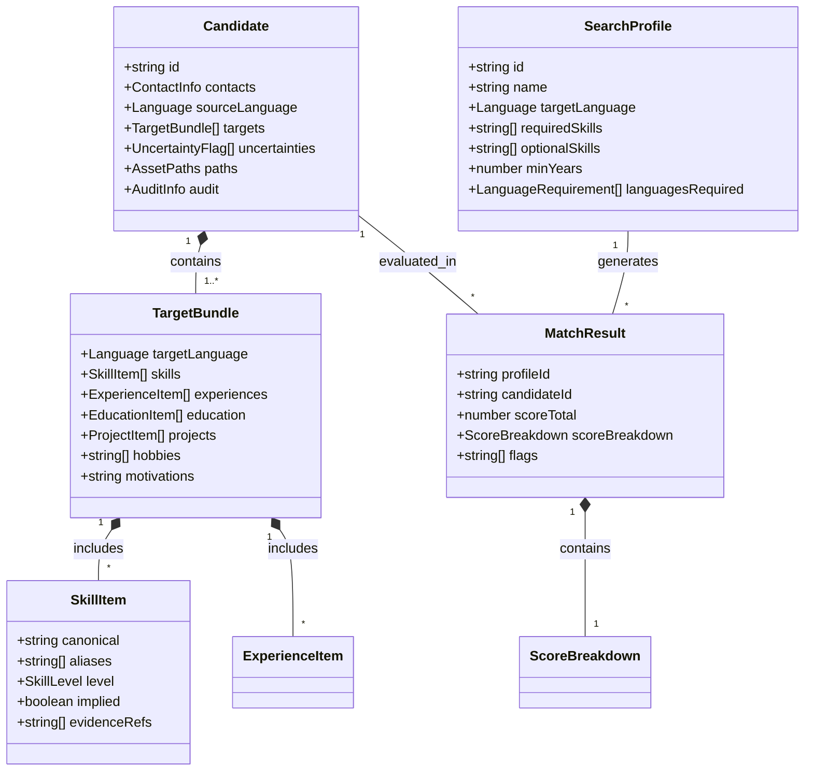
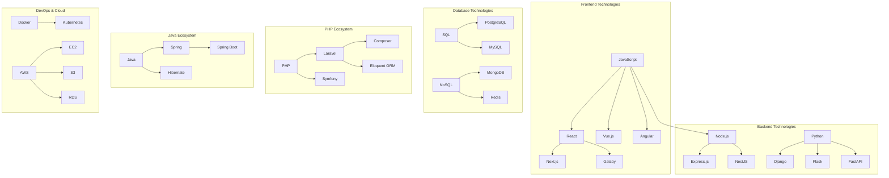
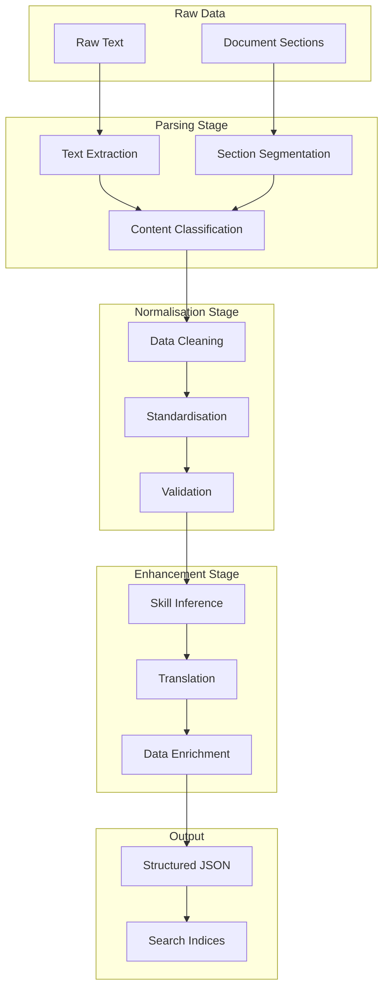

# Data Model Specification - CV Matching Tool

**Project**: Randstad Digital Belgium - CV Matching Tool  
**Version**: 1.0  
**Date**: 08 September 2025  
**Related Documents**: [Technical Specification](./TECH-SPEC.md), [System Architecture](./ARCHITECTURE.md), [Storage Design](./STORAGE.md)

---

## Table of Contents

1. [Data Model Overview](#1-data-model-overview)
2. [Core Entity Definitions](#2-core-entity-definitions)
3. [Relationship Model](#3-relationship-model)
4. [JSON Schema Definitions](#4-json-schema-definitions)
5. [Data Validation Rules](#5-data-validation-rules)
6. [Data Transformation Patterns](#6-data-transformation-patterns)
7. [Index Structures](#7-index-structures)

---

## 1. Data Model Overview

### 1.1 Entity Relationship Diagram



### 1.2 Data Flow Model



---

## 2. Core Entity Definitions

### 2.1 Candidate Entity

```typescript
interface Candidate {
  /** Unique identifier for the candidate */
  id: string;
  
  /** Contact information */
  contacts: ContactInfo;
  
  /** Original language of the CV */
  sourceLanguage: Language;
  
  /** Parallel language versions of the candidate data */
  targets: TargetBundle[];
  
  /** Flags for uncertain or ambiguous data */
  uncertainties: UncertaintyFlag[];
  
  /** File paths for original and generated assets */
  paths: AssetPaths;
  
  /** Audit trail information */
  audit: AuditInfo;
}
```

### 2.2 Contact Information

```typescript
interface ContactInfo {
  /** Full name of the candidate */
  name: string;
  
  /** Email address */
  email?: string;
  
  /** Phone number */
  phone?: string;
  
  /** LinkedIn profile URL */
  linkedin?: string;
  
  /** Current location/city */
  location?: string;
  
  /** Nationality */
  nationality?: string;
  
  /** EU citizenship status */
  euStatus?: 'EU Citizen' | 'Non-EU' | 'Unknown';
}
```

### 2.3 Target Bundle (Language-specific Content)

```typescript
interface TargetBundle {
  /** Target language code (ISO 639-1) */
  targetLanguage: Language;
  
  /** Technical and soft skills */
  skills: SkillItem[];
  
  /** Work experience entries */
  experiences: ExperienceItem[];
  
  /** Educational background */
  education: EducationItem[];
  
  /** Personal or side projects */
  projects: ProjectItem[];
  
  /** Hobbies and interests */
  hobbies: string[];
  
  /** Career motivations and goals */
  motivations: string;
  
  /** Language proficiency */
  languages: LanguageProficiency[];
}
```

### 2.4 Skill Item

```typescript
interface SkillItem {
  /** Standardised skill name */
  canonical: string;
  
  /** Alternative names found in CV */
  aliases: string[];
  
  /** Proficiency level */
  level: SkillLevel;
  
  /** Whether skill was inferred from other skills */
  implied: boolean;
  
  /** References to supporting evidence in experiences */
  evidenceRefs: string[];
  
  /** Years of experience with this skill */
  yearsExperience?: number;
  
  /** Last used date */
  lastUsed?: string;
  
  /** Confidence score (0-100) */
  confidence: number;
}

type SkillLevel = 'Beginner' | 'Intermediate' | 'Advanced' | 'Expert' | 'Unknown';
```

### 2.5 Experience Item

```typescript
interface ExperienceItem {
  /** Company or organisation name */
  company: string;
  
  /** Job title/role */
  role: string;
  
  /** Employment start date */
  startDate: string;
  
  /** Employment end date (null if current) */
  endDate: string | null;
  
  /** Key responsibilities and achievements */
  bullets: string[];
  
  /** Technologies used in this role */
  techStack: string[];
  
  /** Industry sector */
  industry?: string;
  
  /** Employment type */
  employmentType?: 'Full-time' | 'Part-time' | 'Contract' | 'Freelance' | 'Internship';
  
  /** Company size */
  companySize?: string;
  
  /** Location of work */
  location?: string;
}
```

### 2.6 Education Item

```typescript
interface EducationItem {
  /** Institution name */
  institution: string;
  
  /** Degree or qualification title */
  degree: string;
  
  /** Field of study */
  fieldOfStudy?: string;
  
  /** Start date */
  startDate: string;
  
  /** End date */
  endDate: string;
  
  /** Grade or GPA */
  grade?: string;
  
  /** Relevant coursework or thesis */
  coursework?: string[];
  
  /** Location of institution */
  location?: string;
}
```

### 2.7 Search Profile

```typescript
interface SearchProfile {
  /** Unique identifier */
  id: string;
  
  /** Profile name */
  name: string;
  
  /** Target language for matching and output */
  targetLanguage: Language;
  
  /** Must-have skills */
  requiredSkills: string[];
  
  /** Nice-to-have skills */
  optionalSkills: string[];
  
  /** Minimum years of experience */
  minYears?: number;
  
  /** Required language proficiencies */
  languagesRequired: LanguageRequirement[];
  
  /** Required certifications */
  certifications: string[];
  
  /** Industry preferences */
  industries?: string[];
  
  /** Role seniority level */
  seniority?: 'Junior' | 'Mid' | 'Senior' | 'Lead' | 'Executive';
  
  /** Creation timestamp */
  createdAt: string;
  
  /** Last modification timestamp */
  updatedAt: string;
  
  /** Profile creator */
  createdBy: string;
}
```

### 2.8 Match Result

```typescript
interface MatchResult {
  /** Search profile ID */
  profileId: string;
  
  /** Candidate ID */
  candidateId: string;
  
  /** Overall match score (0-100) */
  scoreTotal: number;
  
  /** Detailed score breakdown */
  scoreBreakdown: ScoreBreakdown;
  
  /** Additional flags or notes */
  flags: string[];
  
  /** Ranking position in results */
  rank: number;
  
  /** Generation timestamp */
  generatedAt: string;
}

interface ScoreBreakdown {
  /** Skills match percentage */
  skills: number;
  
  /** Experience relevance score */
  experience: number;
  
  /** Language proficiency match */
  languages: number;
  
  /** Education relevance */
  education: number;
  
  /** Additional factors */
  extras: number;
  
  /** Detailed explanations */
  explanations: {
    skills: string[];
    experience: string[];
    languages: string[];
    education: string[];
  };
}
```

---

## 3. Relationship Model

### 3.1 Core Relationships



### 3.2 Skill Relationship Graph



---

## 4. JSON Schema Definitions

### 4.1 Candidate Schema

```json
{
  "$schema": "https://json-schema.org/draft/2020-12/schema",
  "$id": "https://randstad-cv-tool.com/schemas/candidate.json",
  "title": "Candidate",
  "type": "object",
  "required": ["id", "sourceLanguage", "targets", "paths"],
  "properties": {
    "id": {
      "type": "string",
      "pattern": "^[0-9a-f]{8}-[0-9a-f]{4}-4[0-9a-f]{3}-[89ab][0-9a-f]{3}-[0-9a-f]{12}$",
      "description": "UUID v4 identifier"
    },
    "contacts": {
      "$ref": "#/$defs/ContactInfo"
    },
    "sourceLanguage": {
      "type": "string",
      "enum": ["nl", "fr", "en", "de", "ro", "pt"],
      "description": "Original language of the CV"
    },
    "targets": {
      "type": "array",
      "items": {
        "$ref": "#/$defs/TargetBundle"
      },
      "minItems": 1,
      "description": "Language-specific versions of candidate data"
    },
    "uncertainties": {
      "type": "array",
      "items": {
        "$ref": "#/$defs/UncertaintyFlag"
      },
      "description": "Flags for uncertain or ambiguous data"
    },
    "paths": {
      "$ref": "#/$defs/AssetPaths"
    },
    "audit": {
      "$ref": "#/$defs/AuditInfo"
    }
  },
  "$defs": {
    "ContactInfo": {
      "type": "object",
      "required": ["name"],
      "properties": {
        "name": {
          "type": "string",
          "minLength": 1,
          "maxLength": 200
        },
        "email": {
          "type": ["string", "null"],
          "format": "email"
        },
        "phone": {
          "type": ["string", "null"],
          "pattern": "^\\+?[1-9]\\d{1,14}$"
        },
        "linkedin": {
          "type": ["string", "null"],
          "format": "uri"
        },
        "location": {
          "type": ["string", "null"],
          "maxLength": 100
        },
        "nationality": {
          "type": ["string", "null"],
          "maxLength": 50
        },
        "euStatus": {
          "type": ["string", "null"],
          "enum": ["EU Citizen", "Non-EU", "Unknown", null]
        }
      }
    },
    "TargetBundle": {
      "type": "object",
      "required": ["targetLanguage", "skills", "experiences"],
      "properties": {
        "targetLanguage": {
          "type": "string",
          "enum": ["nl", "fr", "en"]
        },
        "skills": {
          "type": "array",
          "items": {
            "$ref": "#/$defs/SkillItem"
          }
        },
        "experiences": {
          "type": "array",
          "items": {
            "$ref": "#/$defs/ExperienceItem"
          }
        },
        "education": {
          "type": "array",
          "items": {
            "$ref": "#/$defs/EducationItem"
          },
          "default": []
        },
        "projects": {
          "type": "array",
          "items": {
            "$ref": "#/$defs/ProjectItem"
          },
          "default": []
        },
        "hobbies": {
          "type": "array",
          "items": {
            "type": "string",
            "maxLength": 100
          },
          "default": []
        },
        "motivations": {
          "type": "string",
          "maxLength": 1000,
          "default": ""
        },
        "languages": {
          "type": "array",
          "items": {
            "$ref": "#/$defs/LanguageProficiency"
          },
          "default": []
        }
      }
    },
    "SkillItem": {
      "type": "object",
      "required": ["canonical", "aliases", "implied", "confidence"],
      "properties": {
        "canonical": {
          "type": "string",
          "minLength": 1,
          "maxLength": 100
        },
        "aliases": {
          "type": "array",
          "items": {
            "type": "string",
            "maxLength": 100
          }
        },
        "level": {
          "type": ["string", "null"],
          "enum": ["Beginner", "Intermediate", "Advanced", "Expert", "Unknown", null]
        },
        "implied": {
          "type": "boolean"
        },
        "evidenceRefs": {
          "type": "array",
          "items": {
            "type": "string"
          },
          "default": []
        },
        "yearsExperience": {
          "type": ["number", "null"],
          "minimum": 0,
          "maximum": 50
        },
        "lastUsed": {
          "type": ["string", "null"],
          "format": "date"
        },
        "confidence": {
          "type": "number",
          "minimum": 0,
          "maximum": 100
        }
      }
    },
    "ExperienceItem": {
      "type": "object",
      "required": ["company", "role", "startDate"],
      "properties": {
        "company": {
          "type": "string",
          "minLength": 1,
          "maxLength": 200
        },
        "role": {
          "type": "string",
          "minLength": 1,
          "maxLength": 200
        },
        "startDate": {
          "type": "string",
          "pattern": "^\\d{4}(-\\d{2}(-\\d{2})?)?$"
        },
        "endDate": {
          "type": ["string", "null"],
          "pattern": "^\\d{4}(-\\d{2}(-\\d{2})?)?$"
        },
        "bullets": {
          "type": "array",
          "items": {
            "type": "string",
            "maxLength": 500
          },
          "default": []
        },
        "techStack": {
          "type": "array",
          "items": {
            "type": "string",
            "maxLength": 50
          },
          "default": []
        },
        "industry": {
          "type": ["string", "null"],
          "maxLength": 100
        },
        "employmentType": {
          "type": ["string", "null"],
          "enum": ["Full-time", "Part-time", "Contract", "Freelance", "Internship", null]
        },
        "companySize": {
          "type": ["string", "null"],
          "enum": ["1-10", "11-50", "51-200", "201-1000", "1000+", null]
        },
        "location": {
          "type": ["string", "null"],
          "maxLength": 100
        }
      }
    },
    "UncertaintyFlag": {
      "type": "object",
      "required": ["field", "reason"],
      "properties": {
        "field": {
          "type": "string",
          "description": "JSON path to the uncertain field"
        },
        "reason": {
          "type": "string",
          "maxLength": 500
        },
        "severity": {
          "type": "string",
          "enum": ["low", "medium", "high"],
          "default": "medium"
        },
        "suggestions": {
          "type": "array",
          "items": {
            "type": "string"
          },
          "default": []
        }
      }
    },
    "AssetPaths": {
      "type": "object",
      "required": ["originalAsset", "generatedAssets"],
      "properties": {
        "originalAsset": {
          "type": "string",
          "description": "Path to original uploaded file"
        },
        "generatedAssets": {
          "type": "array",
          "items": {
            "type": "string"
          },
          "description": "Paths to generated PDF files"
        }
      }
    },
    "AuditInfo": {
      "type": "object",
      "properties": {
        "createdAt": {
          "type": "string",
          "format": "date-time"
        },
        "updatedAt": {
          "type": "string",
          "format": "date-time"
        },
        "by": {
          "type": "string",
          "description": "User who created/modified this record"
        }
      }
    }
  }
}
```

### 4.2 Search Profile Schema

```json
{
  "$schema": "https://json-schema.org/draft/2020-12/schema",
  "$id": "https://randstad-cv-tool.com/schemas/search-profile.json",
  "title": "SearchProfile",
  "type": "object",
  "required": ["id", "name", "targetLanguage", "requiredSkills"],
  "properties": {
    "id": {
      "type": "string",
      "pattern": "^[0-9a-f]{8}-[0-9a-f]{4}-4[0-9a-f]{3}-[89ab][0-9a-f]{3}-[0-9a-f]{12}$"
    },
    "name": {
      "type": "string",
      "minLength": 1,
      "maxLength": 200
    },
    "targetLanguage": {
      "type": "string",
      "enum": ["nl", "fr", "en"]
    },
    "requiredSkills": {
      "type": "array",
      "items": {
        "type": "string",
        "minLength": 1,
        "maxLength": 100
      },
      "minItems": 1
    },
    "optionalSkills": {
      "type": "array",
      "items": {
        "type": "string",
        "maxLength": 100
      },
      "default": []
    },
    "minYears": {
      "type": ["number", "null"],
      "minimum": 0,
      "maximum": 50
    },
    "languagesRequired": {
      "type": "array",
      "items": {
        "$ref": "#/$defs/LanguageRequirement"
      },
      "default": []
    },
    "certifications": {
      "type": "array",
      "items": {
        "type": "string",
        "maxLength": 200
      },
      "default": []
    },
    "createdAt": {
      "type": "string",
      "format": "date-time"
    },
    "updatedAt": {
      "type": "string",
      "format": "date-time"
    }
  },
  "$defs": {
    "LanguageRequirement": {
      "type": "object",
      "required": ["language", "level"],
      "properties": {
        "language": {
          "type": "string",
          "enum": ["nl", "fr", "en", "de", "es", "pt"]
        },
        "level": {
          "type": "string",
          "enum": ["A1", "A2", "B1", "B2", "C1", "C2", "Native"]
        }
      }
    }
  }
}
```

---

## 5. Data Validation Rules

### 5.1 Business Logic Validation

```typescript
interface ValidationRule<T> {
  field: keyof T;
  validate: (value: any, context: T) => ValidationResult;
  message: string;
}

interface ValidationResult {
  isValid: boolean;
  errors: string[];
  warnings: string[];
}

// Candidate validation rules
const candidateValidationRules: ValidationRule<Candidate>[] = [
  {
    field: 'contacts',
    validate: (contacts: ContactInfo) => {
      const errors: string[] = [];
      const warnings: string[] = [];
      
      if (!contacts.name || contacts.name.trim().length === 0) {
        errors.push('Name is required');
      }
      
      if (contacts.email && !isValidEmail(contacts.email)) {
        errors.push('Invalid email format');
      }
      
      if (!contacts.email && !contacts.phone) {
        warnings.push('No contact method available');
      }
      
      return { isValid: errors.length === 0, errors, warnings };
    },
    message: 'Contact information validation'
  },
  {
    field: 'targets',
    validate: (targets: TargetBundle[]) => {
      const errors: string[] = [];
      const warnings: string[] = [];
      
      if (targets.length === 0) {
        errors.push('At least one target language bundle required');
      }
      
      const languages = targets.map(t => t.targetLanguage);
      const duplicates = languages.filter((lang, index) => languages.indexOf(lang) !== index);
      
      if (duplicates.length > 0) {
        errors.push(`Duplicate target languages: ${duplicates.join(', ')}`);
      }
      
      return { isValid: errors.length === 0, errors, warnings };
    },
    message: 'Target bundles validation'
  }
];
```

### 5.2 Data Quality Checks

```typescript
interface QualityCheck {
  name: string;
  description: string;
  check: (candidate: Candidate) => QualityResult;
  severity: 'error' | 'warning' | 'info';
}

interface QualityResult {
  passed: boolean;
  score: number; // 0-100
  details: string;
  suggestions: string[];
}

const qualityChecks: QualityCheck[] = [
  {
    name: 'skill_coverage',
    description: 'Check if candidate has sufficient skill information',
    severity: 'warning',
    check: (candidate: Candidate) => {
      const totalSkills = candidate.targets
        .flatMap(t => t.skills)
        .filter(s => !s.implied).length;
      
      const score = Math.min(100, (totalSkills / 5) * 100);
      
      return {
        passed: totalSkills >= 3,
        score,
        details: `Found ${totalSkills} explicit skills`,
        suggestions: totalSkills < 3 ? ['Add more technical skills', 'Review CV for missing competencies'] : []
      };
    }
  },
  {
    name: 'experience_depth',
    description: 'Check if experience information is detailed enough',
    severity: 'info',
    check: (candidate: Candidate) => {
      const experiences = candidate.targets[0]?.experiences || [];
      const avgBullets = experiences.reduce((sum, exp) => sum + exp.bullets.length, 0) / experiences.length || 0;
      
      const score = Math.min(100, (avgBullets / 3) * 100);
      
      return {
        passed: avgBullets >= 2,
        score,
        details: `Average ${avgBullets.toFixed(1)} bullets per experience`,
        suggestions: avgBullets < 2 ? ['Add more detail to work experience', 'Include specific achievements'] : []
      };
    }
  }
];
```

---

## 6. Data Transformation Patterns

### 6.1 Input Transformation Pipeline



### 6.2 Skill Canonicalisation

```typescript
interface SkillMapping {
  canonical: string;
  aliases: string[];
  category: string;
  implies: string[];
  requiredFor: string[];
}

const skillMappings: SkillMapping[] = [
  {
    canonical: "React",
    aliases: ["ReactJS", "React.js", "React JS"],
    category: "Frontend Framework",
    implies: ["JavaScript", "JSX", "npm"],
    requiredFor: ["Next.js", "Gatsby"]
  },
  {
    canonical: "Laravel",
    aliases: ["Laravel Framework"],
    category: "Backend Framework", 
    implies: ["PHP", "Composer", "Eloquent"],
    requiredFor: []
  },
  {
    canonical: "Spring Boot",
    aliases: ["SpringBoot", "Spring-Boot"],
    category: "Backend Framework",
    implies: ["Java", "Spring", "Maven"],
    requiredFor: []
  }
];

class SkillNormaliser {
  normalise(inputSkills: string[]): SkillItem[] {
    return inputSkills.map(skill => {
      const mapping = this.findMapping(skill);
      const impliedSkills = this.getImpliedSkills(mapping);
      
      return {
        canonical: mapping.canonical,
        aliases: [skill].filter(alias => alias !== mapping.canonical),
        level: this.inferLevel(skill, mapping),
        implied: false,
        evidenceRefs: [],
        confidence: this.calculateConfidence(skill, mapping)
      };
    }).concat(this.addImpliedSkills(inputSkills));
  }
  
  private findMapping(skill: string): SkillMapping {
    const normalised = skill.toLowerCase().trim();
    
    return skillMappings.find(mapping => 
      mapping.canonical.toLowerCase() === normalised ||
      mapping.aliases.some(alias => alias.toLowerCase() === normalised)
    ) || {
      canonical: skill,
      aliases: [],
      category: "Other",
      implies: [],
      requiredFor: []
    };
  }
}
```

### 6.3 Translation Strategy

```typescript
interface TranslationStrategy {
  detectLanguage(text: string): Promise<Language>;
  translate(text: string, targetLang: Language): Promise<TranslationResult>;
  preserveStructure(original: any, translated: any): any;
}

interface TranslationResult {
  translatedText: string;
  confidence: number;
  alternatives: string[];
  flags: TranslationFlag[];
}

interface TranslationFlag {
  type: 'ambiguous' | 'technical_term' | 'cultural_reference' | 'formatting';
  original: string;
  suggestion: string;
  confidence: number;
}

class ParallelTranslationStrategy implements TranslationStrategy {
  async translateTargetBundle(
    source: TargetBundle, 
    targetLang: Language
  ): Promise<TargetBundle> {
    
    const translated: TargetBundle = {
      targetLanguage: targetLang,
      skills: await this.translateSkills(source.skills, targetLang),
      experiences: await this.translateExperiences(source.experiences, targetLang),
      education: await this.translateEducation(source.education, targetLang),
      projects: await this.translateProjects(source.projects, targetLang),
      hobbies: await this.translateArray(source.hobbies, targetLang),
      motivations: await this.translateText(source.motivations, targetLang),
      languages: source.languages // Language proficiency doesn't need translation
    };
    
    return translated;
  }
  
  private async translateSkills(
    skills: SkillItem[], 
    targetLang: Language
  ): Promise<SkillItem[]> {
    // Skills often don't need translation (technical terms are universal)
    // But we may need to translate skill levels and evidence references
    return Promise.all(skills.map(async skill => ({
      ...skill,
      evidenceRefs: await this.translateArray(skill.evidenceRefs, targetLang)
    })));
  }
}
```

---

## 7. Index Structures

### 7.1 Skills Index

```json
{
  "version": 1,
  "generatedAt": "2025-09-08T10:00:00Z",
  "metadata": {
    "totalSkills": 1247,
    "totalCandidates": 892,
    "lastRebuild": "2025-09-08T09:00:00Z"
  },
  "data": {
    "React": {
      "candidateIds": ["uuid-123", "uuid-456", "uuid-789"],
      "levels": {
        "Beginner": ["uuid-123"],
        "Intermediate": ["uuid-456"],
        "Advanced": ["uuid-789"]
      },
      "impliedBy": ["Next.js", "Gatsby"],
      "category": "Frontend Framework"
    },
    "Python": {
      "candidateIds": ["uuid-234", "uuid-567"],
      "levels": {
        "Advanced": ["uuid-234", "uuid-567"]
      },
      "impliedBy": ["Django", "TensorFlow", "Flask"],
      "category": "Programming Language"
    }
  }
}
```

### 7.2 Text Search Index

```json
{
  "version": 1,
  "generatedAt": "2025-09-08T10:00:00Z",
  "tokenizer": {
    "type": "trigram",
    "normalisation": "lowercase|diacritics|stemming",
    "languages": ["nl", "fr", "en", "de", "ro", "pt"]
  },
  "data": {
    "rea": {
      "candidateIds": ["uuid-123", "uuid-456"],
      "contexts": {
        "uuid-123": ["React developer", "creative problem-solving"],
        "uuid-456": ["real-time systems"]
      }
    },
    "dev": {
      "candidateIds": ["uuid-123", "uuid-234", "uuid-567"],
      "contexts": {
        "uuid-123": ["React developer", "frontend development"],
        "uuid-234": ["DevOps engineer"],
        "uuid-567": ["game developer"]
      }
    }
  }
}
```

### 7.3 Candidate Metadata Index

```json
{
  "version": 1,
  "generatedAt": "2025-09-08T10:00:00Z",
  "data": {
    "uuid-123": {
      "name": "Jan Jansen",
      "sourceLanguage": "nl",
      "targetLanguages": ["en", "fr"],
      "totalSkills": 12,
      "yearsExperience": 5,
      "lastUpdated": "2025-09-07T14:30:00Z",
      "qualityScore": 85,
      "euStatus": "EU Citizen",
      "location": "Amsterdam"
    },
    "uuid-456": {
      "name": "Claire Dupont", 
      "sourceLanguage": "fr",
      "targetLanguages": ["en", "nl"],
      "totalSkills": 8,
      "yearsExperience": 3,
      "lastUpdated": "2025-09-06T16:45:00Z",
      "qualityScore": 78,
      "euStatus": "EU Citizen",
      "location": "Brussels"
    }
  }
}
```

### 7.4 Index Update Strategies

```typescript
interface IndexUpdateStrategy {
  shouldRebuild(): boolean;
  incrementalUpdate(candidateId: string, candidate: Candidate): Promise<void>;
  fullRebuild(): Promise<void>;
}

class SmartIndexStrategy implements IndexUpdateStrategy {
  private updateCount = 0;
  private lastFullRebuild = new Date();
  
  shouldRebuild(): boolean {
    const hoursSinceRebuild = (Date.now() - this.lastFullRebuild.getTime()) / (1000 * 60 * 60);
    return this.updateCount > 50 || hoursSinceRebuild > 24;
  }
  
  async incrementalUpdate(candidateId: string, candidate: Candidate): Promise<void> {
    // Update specific candidate in indices
    await this.updateSkillsIndex(candidateId, candidate);
    await this.updateTextIndex(candidateId, candidate);
    await this.updateMetadataIndex(candidateId, candidate);
    
    this.updateCount++;
    
    if (this.shouldRebuild()) {
      await this.fullRebuild();
    }
  }
  
  async fullRebuild(): Promise<void> {
    // Rebuild all indices from scratch
    const allCandidates = await this.loadAllCandidates();
    
    await Promise.all([
      this.rebuildSkillsIndex(allCandidates),
      this.rebuildTextIndex(allCandidates),
      this.rebuildMetadataIndex(allCandidates)
    ]);
    
    this.updateCount = 0;
    this.lastFullRebuild = new Date();
  }
}