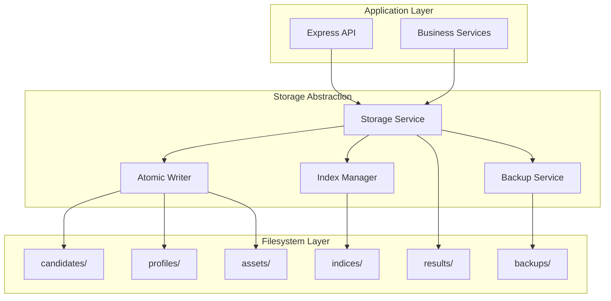
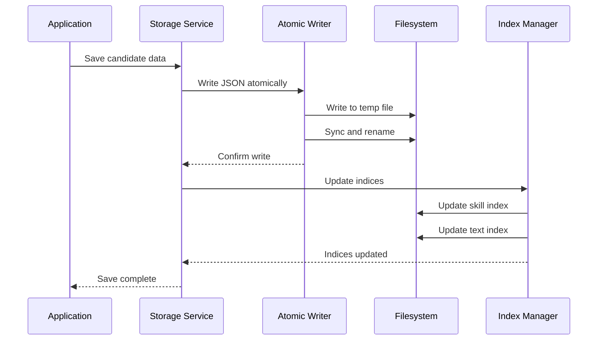
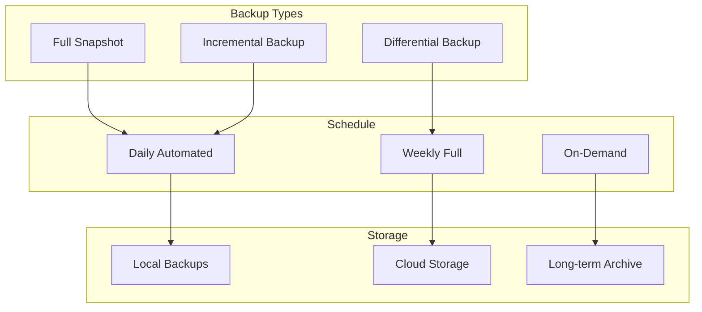

# Storage Design Specification - CV Matching Tool

**Project**: Randstad Digital Belgium - CV Matching Tool  
**Version**: 1.1  
**Date**: 11 September 2025  
**Related Documents**: [Technical Specification](./TECH-SPEC.md), [System Architecture](./ARCHITECTURE.md), [Data Model](./DATA-MODEL.md)

---

## Table of Contents

1. [Storage Overview](#1-storage-overview)
2. [Directory Structure](#2-directory-structure)
3. [File Naming Conventions](#3-file-naming-conventions)
4. [Data Persistence Patterns](#4-data-persistence-patterns)
5. [Index Management](#5-index-management)
6. [Backup and Recovery](#6-backup-and-recovery)
7. [GDPR Compliance](#7-gdpr-compliance)
8. [Performance Optimization](#8-performance-optimization)

---

## 1. Storage Overview

### 1.1 Design Principles
- **No Database Dependency**: Pure filesystem-based storage for simplicity
- **Atomic Operations**: All writes are atomic to prevent corruption
- **Human Readable**: JSON format for easy debugging and inspection
- **Scalable Structure**: Organized for efficient access up to 1,000 CVs
- **GDPR Ready**: Built-in support for data export and deletion

### 1.2 Storage Architecture



### 1.3 Data Flow Patterns



---

## 2. Directory Structure

### 2.1 Complete Storage Layout

```
storage/
├── assets/                          # Binary files (PDFs, images)
│   ├── originals/                   # Uploaded CV files
│   │   └── {candidateId}/           # One folder per candidate
│   │       ├── cv.pdf              # Original CV file
│   │       ├── cv.docx             # Alternative format
│   │       └── metadata.json       # File metadata
│   └── generated/                   # System-generated files
│       └── {candidateId}/           # One folder per candidate
│           ├── {filename}.pdf       # Rewritten CVs
│           ├── {filename}.docx      # DIGIT-TM format exports
│           └── {filename}.json      # Generation metadata
├── raw-extract/                     # Raw parsing results
│   └── {candidateId}.raw.json      # Unprocessed extraction data
├── candidates/                      # Normalised candidate data
│   └── {candidateId}.json          # Structured candidate information
├── profiles/                        # Search profiles
│   └── {profileId}.json            # Profile definitions
├── results/                         # Match results
│   └── match-{profileId}-{timestamp}.json  # Matching outcomes
├── indices/                         # Search indices
│   ├── skills.index.json           # Skills → candidates mapping
│   ├── text.index.json             # Text search index
│   ├── meta.json                    # Index metadata
│   └── .lock                        # Index update lock file
├── master-data/                     # Reference data
│   ├── digit-keywords.json         # DIGIT-TM master keyword list
│   ├── skill-mappings.json         # Skill canonicalisation rules
│   ├── implied-skills.json         # Skill implication rules
│   └── language-mappings.json      # Language proficiency mappings
├── backups/                         # System backups
│   ├── snapshot-{date}-{time}.tar.gz  # Full system snapshots
│   └── daily/                       # Daily incremental backups
└── system/                          # System files
    ├── config.json                 # System configuration
    ├── audit.log                   # Audit trail
    └── gdpr/                        # GDPR compliance records
        ├── exports/                 # Data export records
        ├── deletions/               # Deletion records
        └── requests.log             # GDPR request log
```

### 2.2 Directory Creation Strategy

```typescript
interface DirectoryManager {
  ensureDirectoryExists(path: string): Promise<void>;
  createCandidateStructure(candidateId: string): Promise<void>;
  createProfileStructure(profileId: string): Promise<void>;
  cleanupTempFiles(): Promise<void>;
}

class FilesystemDirectoryManager implements DirectoryManager {
  private readonly basePath: string;
  
  constructor(basePath: string) {
    this.basePath = basePath;
  }
  
  async ensureDirectoryExists(path: string): Promise<void> {
    const fullPath = join(this.basePath, path);
    await mkdir(fullPath, { recursive: true });
  }
  
  async createCandidateStructure(candidateId: string): Promise<void> {
    const paths = [
      `assets/originals/${candidateId}`,
      `assets/generated/${candidateId}`
    ];
    
    await Promise.all(
      paths.map(path => this.ensureDirectoryExists(path))
    );
  }
  
  async createProfileStructure(profileId: string): Promise<void> {
    // Profiles are stored as single files, no directory structure needed
    await this.ensureDirectoryExists('profiles');
  }
  
  async cleanupTempFiles(): Promise<void> {
    const tempPattern = /\.tmp$/;
    const directories = ['candidates', 'profiles', 'indices'];
    
    for (const dir of directories) {
      const fullPath = join(this.basePath, dir);
      const files = await readdir(fullPath);
      
      for (const file of files) {
        if (tempPattern.test(file)) {
          await unlink(join(fullPath, file));
        }
      }
    }
  }
}
```

---

## 3. File Naming Conventions

### 3.1 Naming Standards

| File Type | Pattern | Example |
|-----------|---------|---------|
| Candidate JSON | `{candidateId}.json` | `uuid-123-456.json` |
| Profile JSON | `{profileId}.json` | `profile-dev-frontend.json` |
| Original CV | `cv.{ext}` | `cv.pdf`, `cv.docx` |
| Generated CV | `{name}_{skills}_{profile}_{lang}_{date}.pdf` | `Jan-Jansen_React-Next_DEV-2025_EN_20250908.pdf` |
| Match Results | `match-{profileId}-{timestamp}.json` | `match-profile-123-20250908-1430.json` |
| Raw Extract | `{candidateId}.raw.json` | `uuid-123-456.raw.json` |
| Backup | `snapshot-{date}-{time}.tar.gz` | `snapshot-20250908-1430.tar.gz` |

### 3.2 ID Generation Strategy

```typescript
interface IdGenerator {
  generateCandidateId(): string;
  generateProfileId(name: string): string;
  generateTimestamp(): string;
  sanitizeFilename(input: string): string;
}

class UUIDIdGenerator implements IdGenerator {
  generateCandidateId(): string {
    return uuidv4();
  }
  
  generateProfileId(name: string): string {
    const sanitized = this.sanitizeFilename(name);
    const timestamp = Date.now().toString(36);
    return `profile-${sanitized}-${timestamp}`;
  }
  
  generateTimestamp(): string {
    return new Date().toISOString()
      .replace(/[:.]/g, '')
      .replace('T', '-')
      .slice(0, 15); // YYYYMMDD-HHMMSS
  }
  
  sanitizeFilename(input: string): string {
    return input
      .toLowerCase()
      .replace(/[^a-z0-9]+/g, '-')
      .replace(/^-+|-+$/g, '')
      .slice(0, 50);
  }
}
```

### 3.3 Filename Construction

```typescript
interface FilenameBuilder {
  buildCVFilename(candidate: Candidate, profile: SearchProfile, language: string): string;
  buildMatchResultFilename(profileId: string): string;
  buildBackupFilename(): string;
}

class StandardFilenameBuilder implements FilenameBuilder {
  buildCVFilename(candidate: Candidate, profile: SearchProfile, language: string): string {
    const name = this.sanitizeName(candidate.contacts.name);
    const skills = this.extractPrimarySkills(candidate);
    const profileCode = this.extractProfileCode(profile);
    const date = new Date().toISOString().slice(0, 10).replace(/-/g, '');
    
    return `${name}_${skills}_${profileCode}_${language.toUpperCase()}_${date}.pdf`;
  }
  
  buildMatchResultFilename(profileId: string): string {
    const timestamp = new Date().toISOString()
      .replace(/[:.]/g, '')
      .replace('T', '-')
      .slice(0, 15);
    
    return `match-${profileId}-${timestamp}.json`;
  }
  
  buildBackupFilename(): string {
    const timestamp = new Date().toISOString()
      .replace(/[:.]/g, '')
      .replace('T', '-')
      .slice(0, 15);
    
    return `snapshot-${timestamp}.tar.gz`;
  }
  
  private sanitizeName(name: string): string {
    return name
      .replace(/\s+/g, '-')
      .replace(/[^a-zA-Z0-9-]/g, '')
      .slice(0, 20);
  }
  
  private extractPrimarySkills(candidate: Candidate): string {
    const skills = candidate.targets[0]?.skills
      .filter(s => !s.implied)
      .slice(0, 2)
      .map(s => s.canonical);
    
    return skills.join('-') || 'General';
  }
  
  private extractProfileCode(profile: SearchProfile): string {
    return profile.name
      .replace(/\s+/g, '-')
      .slice(0, 15)
      .toUpperCase();
  }
}
```

---

## 4. Data Persistence Patterns

### 4.1 Atomic Write Operations

```typescript
interface AtomicWriter {
  writeJSON<T>(path: string, data: T): Promise<void>;
  writeBuffer(path: string, buffer: Buffer): Promise<void>;
  exists(path: string): Promise<boolean>;
  read<T>(path: string): Promise<T>;
}

class FilesystemAtomicWriter implements AtomicWriter {
  async writeJSON<T>(path: string, data: T): Promise<void> {
    const tempPath = `${path}.tmp`;
    const jsonData = JSON.stringify(data, null, 2);
    
    try {
      // Write to temporary file
      await writeFile(tempPath, jsonData, 'utf8');
      
      // Sync to disk
      const fd = await open(tempPath, 'r+');
      await fd.sync();
      await fd.close();
      
      // Atomic rename
      await rename(tempPath, path);
      
    } catch (error) {
      // Cleanup temp file on failure
      try {
        await unlink(tempPath);
      } catch (cleanupError) {
        // Ignore cleanup errors
      }
      throw error;
    }
  }
  
  async writeBuffer(path: string, buffer: Buffer): Promise<void> {
    const tempPath = `${path}.tmp`;
    
    try {
      await writeFile(tempPath, buffer);
      
      const fd = await open(tempPath, 'r+');
      await fd.sync();
      await fd.close();
      
      await rename(tempPath, path);
      
    } catch (error) {
      try {
        await unlink(tempPath);
      } catch (cleanupError) {
        // Ignore cleanup errors
      }
      throw error;
    }
  }
  
  async exists(path: string): Promise<boolean> {
    try {
      await access(path);
      return true;
    } catch {
      return false;
    }
  }
  
  async read<T>(path: string): Promise<T> {
    const content = await readFile(path, 'utf8');
    return JSON.parse(content);
  }
}
```

### 4.2 Concurrent Access Control

```typescript
interface LockManager {
  acquireLock(resource: string, timeout?: number): Promise<Lock>;
  releaseLock(lock: Lock): Promise<void>;
  isLocked(resource: string): boolean;
}

interface Lock {
  id: string;
  resource: string;
  acquiredAt: Date;
  expiresAt: Date;
}

class FilesystemLockManager implements LockManager {
  private locks = new Map<string, Lock>();
  
  async acquireLock(resource: string, timeout = 5000): Promise<Lock> {
    const lockFile = `${resource}.lock`;
    const lockId = uuidv4();
    const now = new Date();
    const expiresAt = new Date(now.getTime() + timeout);
    
    // Check for existing lock
    if (await this.isFileLocked(lockFile)) {
      throw new Error(`Resource ${resource} is already locked`);
    }
    
    const lock: Lock = {
      id: lockId,
      resource,
      acquiredAt: now,
      expiresAt
    };
    
    // Write lock file
    await writeFile(lockFile, JSON.stringify(lock));
    this.locks.set(resource, lock);
    
    // Set cleanup timer
    setTimeout(() => {
      this.releaseLock(lock).catch(console.error);
    }, timeout);
    
    return lock;
  }
  
  async releaseLock(lock: Lock): Promise<void> {
    const lockFile = `${lock.resource}.lock`;
    
    try {
      await unlink(lockFile);
      this.locks.delete(lock.resource);
    } catch (error) {
      // Lock file might already be cleaned up
    }
  }
  
  isLocked(resource: string): boolean {
    const lock = this.locks.get(resource);
    if (!lock) return false;
    
    // Check if lock has expired
    if (new Date() > lock.expiresAt) {
      this.locks.delete(resource);
      return false;
    }
    
    return true;
  }
  
  private async isFileLocked(lockFile: string): boolean {
    try {
      const content = await readFile(lockFile, 'utf8');
      const lock = JSON.parse(content);
      return new Date() <= new Date(lock.expiresAt);
    } catch {
      return false;
    }
  }
}
```

### 4.3 Data Versioning Strategy

```typescript
interface VersionedEntity {
  version: number;
  lastModified: string;
  checksum: string;
}

interface VersionManager {
  saveVersioned<T extends VersionedEntity>(path: string, data: T): Promise<void>;
  loadVersioned<T extends VersionedEntity>(path: string): Promise<T>;
  getVersion(path: string): Promise<number>;
  createChecksum(data: any): string;
}

class SHA256VersionManager implements VersionManager {
  async saveVersioned<T extends VersionedEntity>(path: string, data: T): Promise<void> {
    // Update version metadata
    const currentVersion = await this.getVersion(path).catch(() => 0);
    const versionedData = {
      ...data,
      version: currentVersion + 1,
      lastModified: new Date().toISOString(),
      checksum: this.createChecksum(data)
    };
    
    const writer = new FilesystemAtomicWriter();
    await writer.writeJSON(path, versionedData);
  }
  
  async loadVersioned<T extends VersionedEntity>(path: string): Promise<T> {
    const writer = new FilesystemAtomicWriter();
    const data = await writer.read<T>(path);
    
    // Verify checksum
    const dataWithoutMeta = { ...data };
    delete (dataWithoutMeta as any).version;
    delete (dataWithoutMeta as any).lastModified;
    delete (dataWithoutMeta as any).checksum;
    
    const expectedChecksum = this.createChecksum(dataWithoutMeta);
    if (data.checksum !== expectedChecksum) {
      throw new Error(`Checksum mismatch for ${path}`);
    }
    
    return data;
  }
  
  async getVersion(path: string): Promise<number> {
    const data = await this.loadVersioned(path);
    return data.version;
  }
  
  createChecksum(data: any): string {
    const hash = createHash('sha256');
    hash.update(JSON.stringify(data, Object.keys(data).sort()));
    return hash.digest('hex');
  }
}
```

---

## 5. Index Management

### 5.1 Index Structure Design

```typescript
interface IndexStructure {
  version: number;
  generatedAt: string;
  metadata: IndexMetadata;
  data: Record<string, any>;
}

interface IndexMetadata {
  totalEntries: number;
  lastFullRebuild: string;
  incrementalUpdates: number;
  checksumAlgorithm: string;
  dataChecksum: string;
}

interface IndexManager {
  buildSkillsIndex(candidates: Candidate[]): Promise<IndexStructure>;
  buildTextIndex(candidates: Candidate[]): Promise<IndexStructure>;
  updateIndex(indexPath: string, candidateId: string, candidate: Candidate): Promise<void>;
  rebuildIndices(): Promise<void>;
  validateIndex(indexPath: string): Promise<boolean>;
}
```

### 5.2 Skills Index Implementation

```typescript
class SkillsIndexManager implements IndexManager {
  async buildSkillsIndex(candidates: Candidate[]): Promise<IndexStructure> {
    const skillsMap = new Map<string, Set<string>>();
    const levelsMap = new Map<string, Map<string, string[]>>();
    const categoriesMap = new Map<string, string>();
    
    // Process all candidates
    for (const candidate of candidates) {
      for (const target of candidate.targets) {
        for (const skill of target.skills) {
          // Add to skills map
          if (!skillsMap.has(skill.canonical)) {
            skillsMap.set(skill.canonical, new Set());
          }
          skillsMap.get(skill.canonical)!.add(candidate.id);
          
          // Add to levels map
          if (!levelsMap.has(skill.canonical)) {
            levelsMap.set(skill.canonical, new Map());
          }
          const levels = levelsMap.get(skill.canonical)!;
          if (!levels.has(skill.level)) {
            levels.set(skill.level, []);
          }
          levels.get(skill.level)!.push(candidate.id);
          
          // Store category if available
          if (this.skillCategories.has(skill.canonical)) {
            categoriesMap.set(skill.canonical, this.skillCategories.get(skill.canonical)!);
          }
        }
      }
    }
    
    // Build index data structure
    const indexData: Record<string, any> = {};
    
    for (const [skill, candidateIds] of skillsMap) {
      indexData[skill] = {
        candidateIds: Array.from(candidateIds),
        totalCandidates: candidateIds.size,
        levels: Object.fromEntries(levelsMap.get(skill) || new Map()),
        category: categoriesMap.get(skill) || 'Other',
        lastUpdated: new Date().toISOString()
      };
    }
    
    return {
      version: 1,
      generatedAt: new Date().toISOString(),
      metadata: {
        totalEntries: skillsMap.size,
        lastFullRebuild: new Date().toISOString(),
        incrementalUpdates: 0,
        checksumAlgorithm: 'sha256',
        dataChecksum: this.calculateChecksum(indexData)
      },
      data: indexData
    };
  }
  
  async updateIndex(indexPath: string, candidateId: string, candidate: Candidate): Promise<void> {
    const lockManager = new FilesystemLockManager();
    const lock = await lockManager.acquireLock(indexPath);
    
    try {
      // Load existing index
      const index = await this.loadIndex(indexPath);
      
      // Remove old entries for this candidate
      this.removeCandidateFromIndex(index, candidateId);
      
      // Add new entries
      this.addCandidateToIndex(index, candidate);
      
      // Update metadata
      index.metadata.incrementalUpdates++;
      index.metadata.dataChecksum = this.calculateChecksum(index.data);
      
      // Save updated index
      const writer = new FilesystemAtomicWriter();
      await writer.writeJSON(indexPath, index);
      
    } finally {
      await lockManager.releaseLock(lock);
    }
  }
}
```

### 5.3 Text Search Index

```typescript
class TextIndexManager {
  private readonly minGramLength = 3;
  private readonly maxGramLength = 6;
  
  async buildTextIndex(candidates: Candidate[]): Promise<IndexStructure> {
    const textMap = new Map<string, Set<string>>();
    const contextMap = new Map<string, Map<string, string[]>>();
    
    for (const candidate of candidates) {
      const allText = this.extractAllText(candidate);
      const tokens = this.tokenize(allText);
      const grams = this.generateNGrams(tokens);
      
      for (const gram of grams) {
        if (!textMap.has(gram)) {
          textMap.set(gram, new Set());
          contextMap.set(gram, new Map());
        }
        
        textMap.get(gram)!.add(candidate.id);
        
        // Store context snippets
        const contexts = this.findContexts(allText, gram);
        contextMap.get(gram)!.set(candidate.id, contexts);
      }
    }
    
    const indexData: Record<string, any> = {};
    
    for (const [gram, candidateIds] of textMap) {
      indexData[gram] = {
        candidateIds: Array.from(candidateIds),
        frequency: candidateIds.size,
        contexts: Object.fromEntries(contextMap.get(gram) || new Map())
      };
    }
    
    return {
      version: 1,
      generatedAt: new Date().toISOString(),
      metadata: {
        totalEntries: textMap.size,
        lastFullRebuild: new Date().toISOString(),
        incrementalUpdates: 0,
        checksumAlgorithm: 'sha256',
        dataChecksum: this.calculateChecksum(indexData)
      },
      data: indexData
    };
  }
  
  private extractAllText(candidate: Candidate): string {
    const texts: string[] = [];
    
    for (const target of candidate.targets) {
      // Extract from experiences
      for (const exp of target.experiences) {
        texts.push(exp.company, exp.role, ...exp.bullets);
      }
      
      // Extract from skills
      for (const skill of target.skills) {
        texts.push(skill.canonical, ...skill.aliases);
      }
      
      // Extract from other fields
      texts.push(target.motivations, ...target.hobbies);
    }
    
    return texts.filter(Boolean).join(' ');
  }
  
  private tokenize(text: string): string[] {
    return text
      .toLowerCase()
      .replace(/[^\w\s]/g, ' ')
      .split(/\s+/)
      .filter(token => token.length >= 2);
  }
  
  private generateNGrams(tokens: string[]): string[] {
    const grams = new Set<string>();
    
    // Character-level n-grams
    const fullText = tokens.join('');
    for (let i = 0; i <= fullText.length - this.minGramLength; i++) {
      for (let len = this.minGramLength; len <= this.maxGramLength && i + len <= fullText.length; len++) {
        grams.add(fullText.slice(i, i + len));
      }
    }
    
    // Word-level tokens
    tokens.forEach(token => grams.add(token));
    
    return Array.from(grams);
  }
  
  private findContexts(text: string, gram: string, maxContexts = 3): string[] {
    const contexts: string[] = [];
    const contextLength = 50;
    
    let index = 0;
    while (index < text.length && contexts.length < maxContexts) {
      const foundIndex = text.indexOf(gram, index);
      if (foundIndex === -1) break;
      
      const start = Math.max(0, foundIndex - contextLength);
      const end = Math.min(text.length, foundIndex + gram.length + contextLength);
      
      contexts.push(text.slice(start, end).trim());
      index = foundIndex + 1;
    }
    
    return contexts;
  }
}
```

### 5.4 Index Maintenance Strategy

```typescript
interface IndexMaintenanceStrategy {
  shouldRebuildIndex(indexPath: string): Promise<boolean>;
  scheduleRebuild(indexPath: string): Promise<void>;
  validateIndexIntegrity(indexPath: string): Promise<ValidationResult>;
}

class SmartIndexMaintenance implements IndexMaintenanceStrategy {
  private readonly maxIncrementalUpdates = 100;
  private readonly maxAgeHours = 24;
  
  async shouldRebuildIndex(indexPath: string): Promise<boolean> {
    try {
      const index = await this.loadIndex(indexPath);
      
      // Check age
      const ageHours = (Date.now() - new Date(index.metadata.lastFullRebuild).getTime()) / (1000 * 60 * 60);
      if (ageHours > this.maxAgeHours) {
        return true;
      }
      
      // Check incremental updates
      if (index.metadata.incrementalUpdates > this.maxIncrementalUpdates) {
        return true;
      }
      
      // Check integrity
      const validation = await this.validateIndexIntegrity(indexPath);
      if (!validation.isValid) {
        return true;
      }
      
      return false;
      
    } catch (error) {
      // Index is corrupted or missing
      return true;
    }
  }
  
  async validateIndexIntegrity(indexPath: string): Promise<ValidationResult> {
    try {
      const index = await this.loadIndex(indexPath);
      
      // Verify checksum
      const calculatedChecksum = this.calculateChecksum(index.data);
      if (calculatedChecksum !== index.metadata.dataChecksum) {
        return {
          isValid: false,
          errors: ['Checksum mismatch - index may be corrupted']
        };
      }
      
      // Verify structure
      if (!index.data || typeof index.data !== 'object') {
        return {
          isValid: false,
          errors: ['Invalid index data structure']
        };
      }
      
      return { isValid: true, errors: [] };
      
    } catch (error) {
      return {
        isValid: false,
        errors: [`Failed to validate index: ${error.message}`]
      };
    }
  }
}
```

---

## 6. Backup and Recovery

### 6.1 Backup Strategy



### 6.2 Backup Implementation

```typescript
interface BackupManager {
  createFullBackup(): Promise<BackupResult>;
  createIncrementalBackup(since: Date): Promise<BackupResult>;
  restoreFromBackup(backupPath: string): Promise<void>;
  listBackups(): Promise<BackupInfo[]>;
  validateBackup(backupPath: string): Promise<boolean>;
}

interface BackupResult {
  backupPath: string;
  size: number;
  filesIncluded: number;
  duration: number;
  checksum: string;
}

class TarGzBackupManager implements BackupManager {
  private readonly backupDir = 'storage/backups';
  
  async createFullBackup(): Promise<BackupResult> {
    const timestamp = new Date().toISOString().replace(/[:.]/g, '').replace('T', '-').slice(0, 15);
    const backupFileName = `snapshot-${timestamp}.tar.gz`;
    const backupPath = join(this.backupDir, backupFileName);
    
    const startTime = Date.now();
    let filesIncluded = 0;
    
    // Create tar.gz archive
    const output = createWriteStream(backupPath);
    const archive = archiver('tar', {
      gzip: true,
      gzipOptions: { level: 6 }
    });
    
    archive.pipe(output);
    
    // Add directories to backup
    const directoriesToBackup = [
      'candidates',
      'profiles', 
      'assets',
      'results',
      'indices',
      'system'
    ];
    
    for (const dir of directoriesToBackup) {
      const fullPath = join('storage', dir);
      if (await this.directoryExists(fullPath)) {
        archive.directory(fullPath, dir);
        filesIncluded += await this.countFiles(fullPath);
      }
    }
    
    // Include metadata
    const metadata = {
      created: new Date().toISOString(),
      version: '1.0',
      type: 'full',
      directories: directoriesToBackup
    };
    
    archive.append(JSON.stringify(metadata, null, 2), { name: 'backup-metadata.json' });
    
    await archive.finalize();
    
    // Wait for write to complete
    await new Promise((resolve, reject) => {
      output.on('close', resolve);
      output.on('error', reject);
    });
    
    const stats = await stat(backupPath);
    const checksum = await this.calculateFileChecksum(backupPath);
    
    return {
      backupPath,
      size: stats.size,
      filesIncluded,
      duration: Date.now() - startTime,
      checksum
    };
  }
  
  async createIncrementalBackup(since: Date): Promise<BackupResult> {
    const timestamp = new Date().toISOString().replace(/[:.]/g, '').replace('T', '-').slice(0, 15);
    const backupFileName = `incremental-${timestamp}.tar.gz`;
    const backupPath = join(this.backupDir, backupFileName);
    
    // Find files modified since the given date
    const modifiedFiles = await this.findModifiedFiles(since);
    
    if (modifiedFiles.length === 0) {
      throw new Error('No files modified since last backup');
    }
    
    const startTime = Date.now();
    
    // Create incremental archive
    const output = createWriteStream(backupPath);
    const archive = archiver('tar', {
      gzip: true,
      gzipOptions: { level: 6 }
    });
    
    archive.pipe(output);
    
    // Add modified files
    for (const file of modifiedFiles) {
      const relativePath = relative('storage', file);
      archive.file(file, { name: relativePath });
    }
    
    // Include metadata
    const metadata = {
      created: new Date().toISOString(),
      version: '1.0',
      type: 'incremental',
      since: since.toISOString(),
      filesCount: modifiedFiles.length
    };
    
    archive.append(JSON.stringify(metadata, null, 2), { name: 'backup-metadata.json' });
    
    await archive.finalize();
    await new Promise((resolve, reject) => {
      output.on('close', resolve);
      output.on('error', reject);
    });
    
    const stats = await stat(backupPath);
    const checksum = await this.calculateFileChecksum(backupPath);
    
    return {
      backupPath,
      size: stats.size,
      filesIncluded: modifiedFiles.length,
      duration: Date.now() - startTime,
      checksum
    };
  }
}
```

### 6.3 Recovery Procedures

```typescript
interface RecoveryManager {
  restoreFullBackup(backupPath: string): Promise<void>;
  restoreSelectiveBackup(backupPath: string, paths: string[]): Promise<void>;
  verifyRestoration(): Promise<ValidationResult>;
  createRecoveryPoint(): Promise<string>;
}

class BackupRecoveryManager implements RecoveryManager {
  async restoreFullBackup(backupPath: string): Promise<void> {
    // Create recovery point before restoration
    const recoveryPoint = await this.createRecoveryPoint();
    
    try {
      // Validate backup before restoration
      if (!await this.validateBackup(backupPath)) {
        throw new Error('Backup validation failed');
      }
      
      // Stop services (if running)
      await this.stopServices();
      
      // Clear existing storage (except backups)
      await this.clearStorage(['backups', 'system/recovery']);
      
      // Extract backup
      await this.extractBackup(backupPath, 'storage');
      
      // Rebuild indices
      await this.rebuildIndices();
      
      // Verify restoration
      const verification = await this.verifyRestoration();
      if (!verification.isValid) {
        throw new Error(`Restoration verification failed: ${verification.errors.join(', ')}`);
      }
      
      // Restart services
      await this.startServices();
      
    } catch (error) {
      // Rollback to recovery point
      await this.rollbackToRecoveryPoint(recoveryPoint);
      throw error;
    }
  }
  
  async createRecoveryPoint(): Promise<string> {
    const timestamp = new Date().toISOString().replace(/[:.]/g, '').replace('T', '-').slice(0, 15);
    const recoveryPath = join('storage', 'system', 'recovery', `recovery-${timestamp}`);
    
    await mkdir(recoveryPath, { recursive: true });
    
    // Copy critical files
    const criticalPaths = [
      'system/config.json',
      'indices',
      'candidates',
      'profiles'
    ];
    
    for (const path of criticalPaths) {
      const sourcePath = join('storage', path);
      const targetPath = join(recoveryPath, path);
      
      if (await this.pathExists(sourcePath)) {
        await this.copyRecursive(sourcePath, targetPath);
      }
    }
    
    return recoveryPath;
  }
}
```

---

## 7. GDPR Compliance

### 7.1 Data Protection Implementation

```typescript
interface GDPRComplianceManager {
  exportPersonalData(candidateId: string): Promise<PersonalDataExport>;
  deletePersonalData(candidateId: string): Promise<DeletionResult>;
  anonymizeData(candidateId: string): Promise<void>;
  auditDataAccess(candidateId: string): Promise<AccessLog[]>;
}

interface PersonalDataExport {
  candidateId: string;
  exportDate: string;
  data: {
    personalInfo: any;
    cvFiles: Buffer[];
    generatedFiles: Buffer[];
    matchResults: any[];
  };
  format: 'json' | 'zip';
  filePath: string;
}

interface DeletionResult {
  candidateId: string;
  deletedAt: string;
  filesDeleted: string[];
  indicesUpdated: string[];
  success: boolean;
  errors: string[];
}

class FilesystemGDPRManager implements GDPRComplianceManager {
  private readonly gdprPath = 'storage/system/gdpr';
  
  async exportPersonalData(candidateId: string): Promise<PersonalDataExport> {
    const exportId = uuidv4();
    const timestamp = new Date().toISOString();
    const exportPath = join(this.gdprPath, 'exports', `export-${candidateId}-${exportId}.zip`);
    
    await mkdir(dirname(exportPath), { recursive: true });
    
    // Collect all personal data
    const data = {
      personalInfo: await this.loadCandidateData(candidateId),
      cvFiles: await this.loadOriginalFiles(candidateId),
      generatedFiles: await this.loadGeneratedFiles(candidateId),
      matchResults: await this.loadMatchResults(candidateId)
    };
    
    // Create ZIP archive
    const output = createWriteStream(exportPath);
    const archive = archiver('zip', { zlib: { level: 9 } });
    
    archive.pipe(output);
    
    // Add JSON data
    archive.append(JSON.stringify(data.personalInfo, null, 2), { 
      name: 'personal-data.json' 
    });
    
    // Add original CV files
    for (let i = 0; i < data.cvFiles.length; i++) {
      archive.append(data.cvFiles[i], { 
        name: `original-files/cv-${i + 1}.pdf` 
      });
    }
    
    // Add generated files
    for (let i = 0; i < data.generatedFiles.length; i++) {
      archive.append(data.generatedFiles[i], { 
        name: `generated-files/cv-${i + 1}.pdf` 
      });
    }
    
    // Add match results
    archive.append(JSON.stringify(data.matchResults, null, 2), { 
      name: 'match-results.json' 
    });
    
    // Add export metadata
    const metadata = {
      exportId,
      candidateId,
      exportDate: timestamp,
      dataTypes: ['personal_info', 'cv_files', 'generated_files', 'match_results'],
      requestedBy: 'system', // Could be user ID in production
      legalBasis: 'data_subject_request'
    };
    
    archive.append(JSON.stringify(metadata, null, 2), { 
      name: 'export-metadata.json' 
    });
    
    await archive.finalize();
    await new Promise((resolve, reject) => {
      output.on('close', resolve);
      output.on('error', reject);
    });
    
    // Log the export
    await this.logDataAccess(candidateId, 'export', metadata);
    
    return {
      candidateId,
      exportDate: timestamp,
      data,
      format: 'zip',
      filePath: exportPath
    };
  }
  
  async deletePersonalData(candidateId: string): Promise<DeletionResult> {
    const deletionTimestamp = new Date().toISOString();
    const errors: string[] = [];
    const filesDeleted: string[] = [];
    const indicesUpdated: string[] = [];
    
    try {
      // 1. Delete candidate JSON
      const candidatePath = join('storage', 'candidates', `${candidateId}.json`);
      if (await this.fileExists(candidatePath)) {
        await unlink(candidatePath);
        filesDeleted.push(candidatePath);
      }
      
      // 2. Delete raw extraction data
      const rawPath = join('storage', 'raw-extract', `${candidateId}.raw.json`);
      if (await this.fileExists(rawPath)) {
        await unlink(rawPath);
        filesDeleted.push(rawPath);
      }
      
      // 3. Delete original assets
      const originalAssetsPath = join('storage', 'assets', 'originals', candidateId);
      if (await this.directoryExists(originalAssetsPath)) {
        await this.removeDirectory(originalAssetsPath);
        filesDeleted.push(originalAssetsPath);
      }
      
      // 4. Delete generated assets
      const generatedAssetsPath = join('storage', 'assets', 'generated', candidateId);
      if (await this.directoryExists(generatedAssetsPath)) {
        await this.removeDirectory(generatedAssetsPath);
        filesDeleted.push(generatedAssetsPath);
      }
      
      // 5. Remove from indices
      const indexPaths = [
        'storage/indices/skills.index.json',
        'storage/indices/text.index.json',
        'storage/indices/meta.json'
      ];
      
      for (const indexPath of indexPaths) {
        if (await this.fileExists(indexPath)) {
          await this.removeFromIndex(indexPath, candidateId);
          indicesUpdated.push(indexPath);
        }
      }
      
      // 6. Clean up match results
      await this.cleanupMatchResults(candidateId);
      
      // 7. Log the deletion
      const deletionRecord = {
        candidateId,
        deletedAt: deletionTimestamp,
        filesDeleted,
        indicesUpdated,
        requestedBy: 'system',
        reason: 'gdpr_right_to_be_forgotten'
      };
      
      await this.logDeletion(deletionRecord);
      
      return {
        candidateId,
        deletedAt: deletionTimestamp,
        filesDeleted,
        indicesUpdated,
        success: true,
        errors
      };
      
    } catch (error) {
      errors.push(error.message);
      
      return {
        candidateId,
        deletedAt: deletionTimestamp,
        filesDeleted,
        indicesUpdated,
        success: false,
        errors
      };
    }
  }
  
  private async logDataAccess(candidateId: string, action: string, metadata: any): Promise<void> {
    const logEntry = {
      timestamp: new Date().toISOString(),
      candidateId,
      action,
      metadata,
      userAgent: 'system',
      ipAddress: 'localhost'
    };
    
    const logPath = join(this.gdprPath, 'access.log');
    await appendFile(logPath, JSON.stringify(logEntry) + '\n');
  }
  
  private async logDeletion(deletionRecord: any): Promise<void> {
    const logPath = join(this.gdprPath, 'deletions.log');
    await appendFile(logPath, JSON.stringify(deletionRecord) + '\n');
  }
}
```

### 7.2 Data Retention Policies

```typescript
interface RetentionPolicy {
  dataType: string;
  retentionPeriod: number; // days
  autoDelete: boolean;
  archiveBeforeDelete: boolean;
}

interface RetentionManager {
  applyRetentionPolicies(): Promise<RetentionResult>;
  getRetentionStatus(candidateId: string): Promise<RetentionStatus>;
  extendRetention(candidateId: string, days: number): Promise<void>;
}

const DEFAULT_RETENTION_POLICIES: RetentionPolicy[] = [
  {
    dataType: 'candidate_data',
    retentionPeriod: 1095, // 3 years
    autoDelete: false,
    archiveBeforeDelete: true
  },
  {
    dataType: 'match_results',
    retentionPeriod: 365, // 1 year
    autoDelete: true,
    archiveBeforeDelete: false
  },
  {
    dataType: 'raw_extracts',
    retentionPeriod: 30, // 1 month
    autoDelete: true,
    archiveBeforeDelete: false
  },
  {
    dataType: 'audit_logs',
    retentionPeriod: 2555, // 7 years (legal requirement)
    autoDelete: false,
    archiveBeforeDelete: true
  }
];

class AutomatedRetentionManager implements RetentionManager {
  async applyRetentionPolicies(): Promise<RetentionResult> {
    const results = {
      processed: 0,
      deleted: 0,
      archived: 0,
      errors: [] as string[]
    };
    
    for (const policy of DEFAULT_RETENTION_POLICIES) {
      try {
        const cutoffDate = new Date();
        cutoffDate.setDate(cutoffDate.getDate() - policy.retentionPeriod);
        
        const expiredItems = await this.findExpiredItems(policy.dataType, cutoffDate);
        results.processed += expiredItems.length;
        
        for (const item of expiredItems) {
          if (policy.archiveBeforeDelete) {
            await this.archiveItem(item);
            results.archived++;
          }
          
          if (policy.autoDelete) {
            await this.deleteItem(item);
            results.deleted++;
          }
        }
        
      } catch (error) {
        results.errors.push(`Error processing ${policy.dataType}: ${error.message}`);
      }
    }
    
    return results;
  }
}
```

---

## 8. Performance Optimization

### 8.1 Caching Strategy

```typescript
interface CacheManager {
  get<T>(key: string): Promise<T | null>;
  set<T>(key: string, value: T, ttl?: number): Promise<void>;
  invalidate(pattern: string): Promise<void>;
  clear(): Promise<void>;
}

class MemoryCacheManager implements CacheManager {
  private cache = new Map<string, CacheEntry>();
  private readonly defaultTTL = 3600; // 1 hour
  
  async get<T>(key: string): Promise<T | null> {
    const entry = this.cache.get(key);
    
    if (!entry) {
      return null;
    }
    
    if (Date.now() > entry.expiresAt) {
      this.cache.delete(key);
      return null;
    }
    
    return entry.value as T;
  }
  
  async set<T>(key: string, value: T, ttl = this.defaultTTL): Promise<void> {
    const expiresAt = Date.now() + (ttl * 1000);
    
    this.cache.set(key, {
      value,
      expiresAt,
      createdAt: Date.now()
    });
  }
  
  async invalidate(pattern: string): Promise<void> {
    const regex = new RegExp(pattern);
    
    for (const [key] of this.cache) {
      if (regex.test(key)) {
        this.cache.delete(key);
      }
    }
  }
  
  async clear(): Promise<void> {
    this.cache.clear();
  }
}

interface CacheEntry {
  value: any;
  expiresAt: number;
  createdAt: number;
}
```

### 8.2 Query Optimization

```typescript
interface QueryOptimizer {
  optimizeSkillsQuery(skills: string[]): Promise<string[]>;
  optimizeTextQuery(query: string): Promise<string>;
  planMatchQuery(profile: SearchProfile): Promise<QueryPlan>;
}

interface QueryPlan {
  estimatedCandidates: number;
  indexStrategy: 'skills' | 'text' | 'hybrid';
  filterOrder: string[];
  cacheKey: string;
}

class SmartQueryOptimizer implements QueryOptimizer {
  async planMatchQuery(profile: SearchProfile): Promise<QueryPlan> {
    // Estimate result size for different strategies
    const skillsEstimate = await this.estimateSkillsResults(profile.requiredSkills);
    const textEstimate = await this.estimateTextResults(profile.name);
    
    // Choose optimal strategy
    let strategy: 'skills' | 'text' | 'hybrid';
    if (skillsEstimate < 100) {
      strategy = 'skills';
    } else if (textEstimate < 50) {
      strategy = 'text';
    } else {
      strategy = 'hybrid';
    }
    
    // Optimize filter order (most selective first)
    const filterOrder = await this.optimizeFilterOrder(profile);
    
    // Generate cache key
    const cacheKey = this.generateCacheKey(profile);
    
    return {
      estimatedCandidates: Math.min(skillsEstimate, textEstimate),
      indexStrategy: strategy,
      filterOrder,
      cacheKey
    };
  }
  
  private async estimateSkillsResults(skills: string[]): Promise<number> {
    const skillsIndex = await this.loadSkillsIndex();
    let estimate = Infinity;
    
    for (const skill of skills) {
      const candidates = skillsIndex.data[skill]?.candidateIds || [];
      estimate = Math.min(estimate, candidates.length);
    }
    
    return estimate === Infinity ? 0 : estimate;
  }
  
  private async optimizeFilterOrder(profile: SearchProfile): Promise<string[]> {
    // Order filters by selectivity (most selective first)
    const filters = [
      'requiredSkills',
      'languagesRequired',
      'certifications',
      'minYears',
      'optionalSkills'
    ];
    
    // Calculate selectivity for each filter
    const selectivity = await Promise.all(
      filters.map(async filter => ({
        filter,
        selectivity: await this.calculateSelectivity(filter, profile)
      }))
    );
    
    // Sort by selectivity (lowest = most selective)
    return selectivity
      .sort((a, b) => a.selectivity - b.selectivity)
      .map(item => item.filter);
  }
}
```

### 8.3 File System Optimization

```typescript
interface FileSystemOptimizer {
  defragmentIndices(): Promise<void>;
  optimizeDirectoryStructure(): Promise<void>;
  cleanupTempFiles(): Promise<void>;
  compactCandidateFiles(): Promise<void>;
}

class FileSystemMaintenanceOptimizer implements FileSystemOptimizer {
  async defragmentIndices(): Promise<void> {
    // Rebuild indices to optimize structure
    const indexPaths = [
      'storage/indices/skills.index.json',
      'storage/indices/text.index.json'
    ];
    
    for (const indexPath of indexPaths) {
      const tempPath = `${indexPath}.optimized`;
      
      // Load, optimize, and rewrite
      const index = await this.loadIndex(indexPath);
      const optimized = this.optimizeIndexStructure(index);
      
      await this.writeIndex(tempPath, optimized);
      await rename(tempPath, indexPath);
    }
  }
  
  async optimizeDirectoryStructure(): Promise<void> {
    // Reorganize files for better access patterns
    const candidatesDir = 'storage/candidates';
    const files = await readdir(candidatesDir);
    
    // Group candidates by creation date for better locality
    const candidatesByDate = new Map<string, string[]>();
    
    for (const file of files) {
      const filePath = join(candidatesDir, file);
      const stats = await stat(filePath);
      const dateKey = stats.birthtime.toISOString().slice(0, 7); // YYYY-MM
      
      if (!candidatesByDate.has(dateKey)) {
        candidatesByDate.set(dateKey, []);
      }
      candidatesByDate.get(dateKey)!.push(file);
    }
    
    // Create date-based subdirectories (if beneficial)
    if (files.length > 500) {
      await this.createDateBasedStructure(candidatesByDate);
    }
  }
  
  private optimizeIndexStructure(index: any): any {
    // Sort keys for better compression and access
    const sortedData: Record<string, any> = {};
    
    for (const key of Object.keys(index.data).sort()) {
      sortedData[key] = index.data[key];
    }
    
    return {
      ...index,
      data: sortedData,
      metadata: {
        ...index.metadata,
        optimizedAt: new Date().toISOString()
      }
    };
  }
}
```

---

**Document Control**

| Version | Date | Author | Changes |
|---------|------|---------|---------|
| 1.0 | 08 Sep 2025 | Development Team | Initial storage specification |

**Review Schedule**: Weekly during development  
**Approval Authority**: Technical Lead  
**Next Review Date**: 15 Sep 2025

---

**Related Documents:**
- [Technical Specification](./TECH-SPEC.md) - Overall system requirements
- [System Architecture](./ARCHITECTURE.md) - High-level system design  
- [Data Model](./DATA-MODEL.md) - Entity relationships and schemas
- [Implementation Guide](./IMPLEMENTATION.md) - Development guidelines